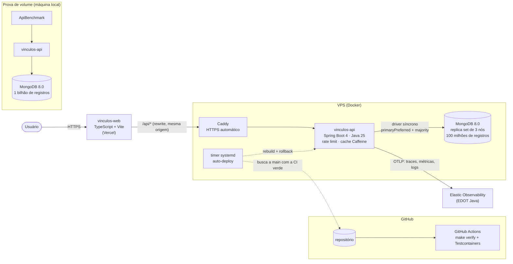
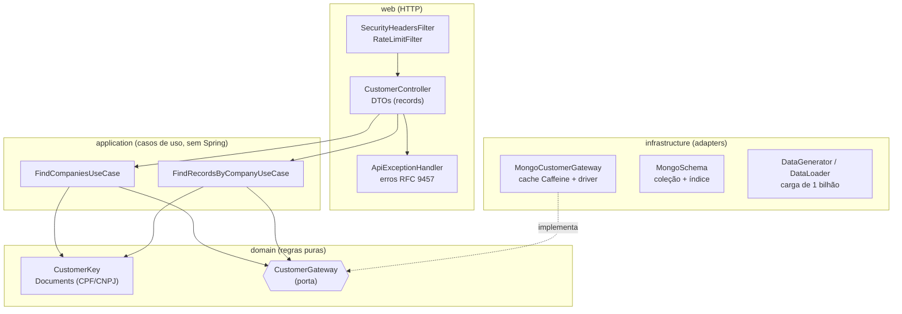
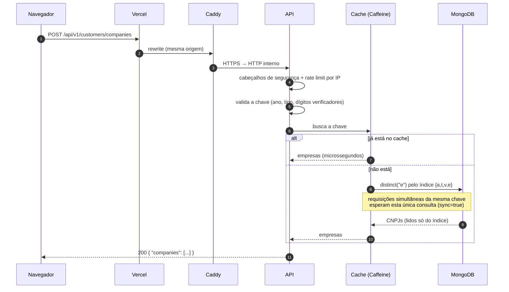

# vinculos-api

[](https://github.com/oliveiravictordev-png/vinculos-api/actions/workflows/ci.yml)

API de consulta de vínculos **cliente × empresa** sobre MongoDB, dimensionada e **testada com 1 bilhão de registros**, com foco em desempenho, confiança nos dados e segurança.

| | |
|---|---|
| **Front (demonstração)** | https://vinculos-web-melhor-perfil.vercel.app (repositório [vinculos-web](https://github.com/oliveiravictordev-png/vinculos-web)) |
| **API pública** | https://vinculos.212-28-185-69.sslip.io |
| **Swagger** | https://vinculos.212-28-185-69.sslip.io/swagger-ui.html |
| **Stack** | Java 25 · Spring Boot 4.1 · MongoDB 8.0 · Caffeine · Log4j2 assíncrono · springdoc-openapi · JUnit 5 + Testcontainers · Docker · OpenTelemetry (Elastic) |

## Sumário

1. [O desafio e como foi atendido](#o-desafio-e-como-foi-atendido)
2. [Arquitetura](#arquitetura)
3. [Endpoints](#endpoints)
4. [Modelo de dados e índice](#modelo-de-dados-e-índice)
5. [Testes de volume: 1 bilhão, 100 milhões e 1 milhão](#testes-de-volume)
6. [Desempenho e cache](#desempenho-e-cache)
7. [Confiança nos dados e segurança](#confiança-nos-dados-e-segurança)
8. [Observabilidade](#observabilidade)
9. [Testes automatizados e cobertura](#testes-automatizados-e-cobertura)
10. [Como rodar](#como-rodar)
11. [Deploy](#deploy)
12. [Próximos passos](#próximos-passos)

## O desafio e como foi atendido

| requisito | como foi atendido |
|---|---|
| Índice do Mongo: ano + tipo do documento + valor do documento | Índice `{ano, tipo, documento, empresa}`. Os três primeiros campos são exatamente o pedido, e a empresa no final deixa o endpoint 1 ser respondido só com o índice. |
| Endpoint 1: a chave do cliente devolve as empresas ligadas a ele | `POST /api/v1/customers/companies` |
| Endpoint 2: chave + `empresas[]` devolvem 1 ou N dados do cliente por empresa | `POST /api/v1/customers/records` |
| Colocar 1 bilhão de registros no banco | **1.000.000.000** de documentos carregados e medidos (78 min), com a API respondendo em p99 de 6 ms (ver [testes de volume](#testes-de-volume)) |

Exemplo do enunciado, que existe na base: **2026 / CPF / 056.858.627-17** (devolve 4 empresas).

## Arquitetura

### Visão geral



- **Front e API são projetos separados**, com build e deploy próprios. O front chama `/api/*` no próprio domínio da Vercel, e a Vercel repassa para a VPS. Para o navegador há uma origem só, então não é preciso CORS.
- **Na VPS**, o Caddy faz o HTTPS e encaminha para o container da API. O MongoDB roda como **replica set de 3 nós** numa rede interna do Docker, sem exposição à internet. Se o primário cair, a API continua respondendo ([alta disponibilidade](#alta-disponibilidade)).
- **A API manda traces, métricas e logs ao Elastic** pelo agente OpenTelemetry, sem nenhuma mudança no código.
- **O deploy é puxado pela VPS:** um timer verifica a `main` a cada 2 minutos e só publica commits cuja CI passou. Nenhuma credencial da VPS fica no GitHub.
- **A prova de volume roda numa máquina local** com 1 bilhão de registros. A demonstração pública usa 100 milhões, o que cabe com folga na VPS.

### Camadas da API



A arquitetura é clean/hexagonal, e **as dependências só apontam para dentro**:
- **`domain`:** as regras de negócio, em Java puro. A `CustomerKey` só existe em estado válido: ela normaliza o documento e confere os dígitos verificadores, inclusive do CNPJ alfanumérico de 2026. O `CustomerGateway` é a porta de saída para o banco.
- **`application`:** os dois casos de uso, sem dependência do Spring. Os beans são registrados em `infrastructure/config`.
- **`infrastructure`:** os adapters. O gateway do MongoDB usa o driver direto com cache; há também o schema, o índice e a carga em massa.
- **`web`:** o controller e os DTOs (`record`s), o tratamento único de erros, o rate limit, os cabeçalhos de segurança e o OpenAPI.

Trocar o banco significaria escrever outro adapter para a mesma porta, sem tocar nos casos de uso. As convenções de código estão no [`CLAUDE.md`](CLAUDE.md).

### Caminho de uma requisição



Erros seguem o mesmo caminho e saem sempre pelo `ApiExceptionHandler`: 400, 429, 500 ou 503 no formato RFC 9457.

## Endpoints

A chave do cliente é **ano + tipo do documento + valor do documento**. Os endpoints usam `POST` com corpo JSON, para que o CPF/CNPJ nunca apareça na URL (logs de acesso, proxies).

### 1. Empresas ligadas ao cliente

```http
POST /api/v1/customers/companies
{ "year": 2026, "documentType": "CPF", "document": "056.858.627-17" }
```
```json
{ "companies": ["10007037000103", "10014956000104", "10022875000148", "10049118000168"] }
```

### 2. Dados do cliente por empresa

```http
POST /api/v1/customers/records
{ "year": 2026, "documentType": "CPF", "document": "056.858.627-17",
  "companies": ["10007037000103", "10049118000168"] }
```
```json
{ "companies": [
    { "company": "10007037000103", "records": [
        { "id": 702879416, "product": "CARTAO_CREDITO", "amount": 93967.53, "updatedAt": "2026-02-23T23:07:04.405Z" } ] },
    { "company": "10049118000168", "records": [
        { "id": 702879415, "product": "INVESTIMENTO", "amount": 49108.59, "updatedAt": "2026-03-11T01:28:26.964Z" },
        { "id": 702879419, "product": "EMPRESTIMO", "amount": 69599.43, "updatedAt": "2026-06-01T08:00:17.779Z" } ] } ] }
```

Esta é a resposta real da API pública para a chave do enunciado. Uma empresa tem 1 registro e a outra tem 2, o "1 ou N" do requisito.

- A resposta traz uma entrada por empresa solicitada, ordenada por CNPJ. Empresa sem vínculo vem com `records: []`, sem ser omitida.
- O limite é de 100 empresas por requisição. Duplicatas e pontuação são normalizadas.

**Swagger:** `/swagger-ui.html`, com a especificação em `/v3/api-docs` e os exemplos já preenchidos com a chave do enunciado.

**Health check:** `/actuator/health`, com `/liveness` e `/readiness`. O readiness só fica `UP` com o MongoDB respondendo, e o `HEALTHCHECK` do Docker usa esse endereço.

**Erros** (RFC 9457, `application/problem+json`):

| status | quando |
|---|---|
| 400 | dado inválido (ano fora de 1900–2100, tipo desconhecido, dígito verificador errado, documento com mais de 18 caracteres) ou requisição malformada (rota inexistente, método errado, JSON quebrado), esta com a mensagem genérica `Invalid request` |
| 429 | acima do rate limit, com `Retry-After` |
| 500 | erro inesperado, sem nenhum detalhe interno |
| 503 | timeout ou indisponibilidade do banco |

A API **nunca responde 404, 405 ou 415**, para não ajudar quem tenta mapear rotas.

## Modelo de dados e índice

Coleção `vinculos`: um documento por registro (cliente × empresa × dado). A coleção é **clusterizada por `_id`**: os documentos ficam gravados na ordem do próprio `_id`, sem um índice `_id` separado.

| campo | significado | tipo |
|---|---|---|
| `_id` | id do registro (determinístico) | long |
| `a` | ano | int |
| `t` | tipo do documento (`CPF`/`CNPJ`) | string |
| `v` | valor do documento | string |
| `e` | CNPJ da empresa | string |
| `p` | produto | string |
| `s` | valor em centavos | long |
| `u` | atualizado em | date |

**Por que nomes de campo curtos:** em 1 bilhão de documentos, cada byte economizado por documento vale cerca de 1 GB.

**Índice `{ a: 1, t: 1, v: 1, e: 1 }`:** é o índice pedido (ano + tipo + documento) com a empresa no final, o que traz dois ganhos:
- **Endpoint 1:** vira um `distinct("e")` coberto pelo índice (`DISTINCT_SCAN`), sem ler nenhum documento do disco.
- **Endpoint 2:** o filtro `$in` de empresas é resolvido no próprio índice, e só são lidos os documentos que de fato vão na resposta.

## Testes de volume

A mesma API e a mesma carga, que é determinística (o cliente N gera sempre os mesmos documentos), foram testadas em três cenários:

| | 1 bilhão (local) | 100 milhões (VPS, pública) | 1 milhão (MongoDB Atlas) |
|---|---|---|---|
| objetivo | provar o requisito de volume | demonstração pública | primeiro teste em banco gerenciado |
| MongoDB | 8.0 portátil, 14 GB de cache | 8.0 em Docker, replica set de 3 nós | Atlas Free (M0), São Paulo |
| inserção | 2.189 s (~457 mil docs/s) | 250 s (~400 mil docs/s) | 84 s (~12 mil docs/s, pela internet) |
| índice | 2.492 s | 143 s | 22 s |
| dados em disco | 23,2 GB (zstd) | 2,3 GB (zstd) | 41 MB (compressão do Atlas) |
| índice da consulta | 15,2 GB | 1,5 GB | 15 MB |
| latência no servidor (endpoint 1) | p50 3,1 ms · p99 6,1 ms | p50 2,2 ms · p99 11,5 ms | não medida |

Todos os valores acima foram medidos. O tamanho cresce linearmente: 100 milhões ocupam exatamente 1/10 do bilhão.

### 1 bilhão de registros (local)

**Ambiente:** notebook com 12 threads, 31 GB de RAM e SSD NVMe de 512 GB; MongoDB 8.0 como replica set de 1 nó, com 14 GB de cache WiredTiger; carga com 8 workers e lotes de 10 mil.

**Carga**

| etapa | tempo |
|---|---|
| inserção de 1.000.000.000 de documentos | 2.189 s (~36 min, ~457 mil docs/s) |
| criação do índice `{a, t, v, e}` | 2.492 s (~42 min) |
| **total** | **4.682 s (~78 min)** |

**Tamanho**

| | medido |
|---|---|
| documentos na coleção | 1.000.000.000 (118 bytes em média) |
| dados sem compressão | 110,8 GB |
| dados em disco (zstd) | **23,2 GB** (4,8× de compressão) |
| índice `ix_ano_tipo_documento_empresa` | **15,2 GB**; não há índice `_id` porque a coleção é clusterizada |
| pasta do MongoDB (inclui journal e oplog) | 44,1 GB |

A coleção clusterizada fez diferença: sem ela, haveria mais cerca de 32 GB de índice `_id`.

**Latência e vazão** (`ApiBenchmark` com 2.000 chaves aleatórias entre os 200 milhões de clientes; API e benchmark na mesma máquina; rate limit desligado):

| endpoint | cache da API | p50 | p95 | p99 |
|---|---|---|---|---|
| 1 (`/companies`) | sem cache | 3,1 ms | 4,9 ms | 6,1 ms |
| 1 (`/companies`) | com cache | 0,6 ms | 1,5 ms | 2,2 ms |
| 2 (`/records`) | sem cache | 2,2 ms | 3,5 ms | 4,3 ms |
| 2 (`/records`) | com cache | 0,4 ms | 0,6 ms | 1,1 ms |

- **Vazão:** **3.973 req/s** no endpoint 1, com chaves sempre novas (sem acerto de cache) e 64 requisições simultâneas, sem nenhum erro em 50 mil requisições.
- No endpoint 2, "sem cache" refere-se ao cache da API: as mesmas chaves tinham acabado de passar pelo endpoint 1, então parte do índice já estava na memória do MongoDB.
- A chave do enunciado responde com 4 empresas sobre o bilhão.

### 100 milhões de registros (VPS, demonstração pública)

**Ambiente:** VPS com 6 vCPU e 12 GB de RAM, compartilhada com outro sistema em produção. Por isso, o MongoDB ficou limitado a 2 CPUs e 3 GB de RAM, e a API a 2 CPUs e 1 GB. A faixa carregada (clientes 140 a 160 milhões) inclui a chave do enunciado.

| medida | resultado |
|---|---|
| carga | 100 milhões em 250 s, mais 143 s de índice (6,5 min no total) |
| latência no servidor (traces no Elastic, endpoint 1) | p50 2,2 ms · p95 6,1 ms · p99 11,5 ms em 4.045 requisições |
| latência no servidor (endpoint 2) | p50 3,5 ms · p95 5,8 ms · p99 6,9 ms |
| consulta no MongoDB (`distinct` / `find`) | p50 1,5 ms / 1,5 ms · p95 3,1 ms / 1,8 ms |
| latência do Brasil até a VPS (EUA) | ~170 ms, quase toda de rede; com e sem cache a diferença é de ~3 ms |
| 8 / 50 requisições simultâneas, mesma chave nova | todas com 200, e **1 consulta** ao MongoDB em cada rodada |
| 80 requisições simultâneas do mesmo IP | 47 aceitas e 33 recusadas com 429 (rate limit) |
| acerto do cache (`companies`) | 97% |

### 1 milhão de registros (MongoDB Atlas)

O primeiro teste em banco gerenciado foi feito no **MongoDB Atlas Free** (M0, AWS São Paulo), com a API rodando localmente e carregando os dados pela internet.

| medida | resultado |
|---|---|
| carga | 1 milhão em 84 s (~12 mil docs/s, limitado pela rede), mais 22 s de índice |
| tamanho | 119 MB sem compressão, 41 MB em disco; índices de 47 MB (32 MB de `_id` e 15 MB do índice da consulta) |
| consulta pelo front (local → Atlas) | 174 ms na primeira chamada, 10 ms com cache |

**O que esse teste ensinou:**
- **O Atlas proíbe a opção `storageEngine`** (zstd) na criação da coleção. A API passou a detectar a recusa e criar a coleção com a compressão do próprio serviço, registrando um aviso.
- **O índice `_id` ocupava 2/3 do espaço de índices.** Isso levou à coleção clusterizada, que eliminou esse índice: em 1 bilhão, foram cerca de 32 GB a menos.
- **1 bilhão no Atlas exigiria um cluster pago.** Cabe com cerca de 40 GB de disco e um índice de 15 GB em RAM, o que equivale a uma instância de 32 GB. O teste de volume ficou numa máquina própria.

### Como reproduzir

```bash
make seed RECORDS=1000000000        # carga de 1 bilhão (determinística e idempotente; pode ser retomada)
make run                            # API sobre a base carregada
make bench API_URL=http://localhost:8080
```

| propriedade da carga | padrão | descrição |
|---|---|---|
| `seed.total-records` | 1000000000 | total de registros (5 por cliente, ou seja, 200 milhões de chaves) |
| `seed.start-customer` | 0 | começa (ou retoma) a partir de um cliente |
| `seed.batch-size` | 10000 | documentos por `insertMany` |
| `seed.workers` | nº de CPUs | threads de inserção |

Como os dados são gerados:
- Cada cliente tem de 1 a 4 empresas e 5 registros distribuídos entre elas, então há empresas com 1 registro e com vários.
- Os anos vão de 2024 a 2026, e cerca de 20% das chaves são CNPJ.
- Todos os documentos têm dígitos verificadores válidos.
- A chave do enunciado é gerada pelo cliente 140.575.883 e existe em qualquer carga a partir de ~703 milhões de registros.
- O índice é criado **no fim** da carga, porque construí-lo uma vez sai bem mais barato que mantê-lo a cada insert.

Opções do benchmark: `-Dbench.first-customer` e `-Dbench.customers` (faixa carregada), `-Dbench.samples`, `-Dbench.concurrency` e `-Dbench.requests`. Contra a VPS, use `make bench-public`, que respeita o rate limit.

## Alta disponibilidade

Na VPS, o MongoDB roda como **replica set de 3 nós** (`deploy/docker-compose.yml`):
- o nó `mongo` tem prioridade 2 e mais cache;
- `mongo2` e `mongo3` recebem cópia completa dos dados;
- o serviço `mongo-init` configura o replica set e pode rodar quantas vezes for preciso sem efeito colateral. A migração do antigo nó único foi feita sem recarregar nada: os dois nós novos copiaram os 100 milhões do primário em ~6,5 minutos.

**Como a API atravessa uma queda:**
1. A leitura usa `primaryPreferred` com read concern `majority`: lê do primário e, se ele cair, de um secundário. Como a leitura é `majority`, o secundário também só devolve dado confirmado pela maioria, que não sofre rollback.
2. O driver refaz automaticamente uma leitura interrompida (retry de leitura), agora noutro nó.
3. Os dois nós restantes elegem um novo primário em segundos.
4. Se nenhum nó estiver disponível, a requisição desiste em 5 s (`serverSelectionTimeoutMS`) e responde 503, em vez de travar.

**Teste de falha automático (CI):** o `ReplicaSetFailoverTest` sobe 3 nós, faz requisições sem parar por 30 s e mata o primário (kill) no meio. Ele verifica que só existem respostas 200 ou 503, que um novo primário é eleito e que tudo volta a 200 em até 15 s. Roda a cada push.

| teste de falha | requisições | depois da queda | respostas diferentes de 200 | primário |
|---|---|---|---|---|
| CI (Testcontainers) | 1.418 | 1.187 | **0** | nó 0 → nó 1 |
| VPS pela internet, primário morto por 30 s e religado | 520 | 451 | **0** (latência máxima de 0,16 s) | `mongo` → secundário → `mongo` de novo |

No teste da VPS, cada requisição usou um CPF diferente para nunca cair no cache, ou seja, todas consultaram o MongoDB de verdade. O nó religado voltou, se atualizou e retomou o primário sozinho, por ter prioridade.

## Desempenho e cache

- **Driver MongoDB direto** (`MongoCollection<Document>` com projeção), sem mapeamento de entidades.
- **Virtual threads** no Tomcat para o I/O bloqueante, com pool de conexões configurado pela URI e espera máxima de 2 s por conexão.
- **`maxTimeMS` de 2 s** em toda consulta: uma consulta lenta é abortada no servidor, em vez de acumular carga. Consultas acima de 200 ms são logadas em WARN.
- **Log4j2 com AsyncLogger (Disruptor):** a thread da requisição não espera o I/O de log.
- **Cache Caffeine** (`companies` e `records`) com `sync=true`: requisições simultâneas da mesma chave fazem uma única consulta ao banco. A chave do endpoint 2 é normalizada (CNPJs ordenados e sem duplicatas), o que aumenta a taxa de acerto. O tamanho é configurável via `CACHE_SPEC`.

### Por que Caffeine e não Redis

| | Caffeine (escolhido) | Redis |
|---|---|---|
| acerto no cache | microssegundos, sem serialização | ~0,5–1 ms (rede + serialização) |
| requisições simultâneas da mesma chave | `sync=true` já agrupa em uma consulta | exige implementação própria |
| compartilhado entre instâncias | não | sim |
| sobrevive a deploy | não | sim |
| custo operacional | nenhum | mais um serviço e mais RAM |

Hoje há **uma única instância** da API, e os dados não mudam depois da carga, então não há invalidação de cache a coordenar. O cache só acelera consultas **repetidas**: entre 200 milhões de clientes, uma chave nova quase nunca está em cache, e quem segura a latência nesse caso é o índice. **Quando trocar:** com várias instâncias atrás de um balanceador, o caminho é cache em dois níveis, com o Caffeine como L1 e o Redis como L2 compartilhado.

## Confiança nos dados e segurança

- **Validação de entrada no domínio:** os dígitos verificadores de CPF e CNPJ são conferidos (inclusive no CNPJ alfanumérico), a pontuação é normalizada e os tamanhos têm limite.
- **Validação de schema no MongoDB** (`$jsonSchema` estrito, gerado a partir das constantes do código): o banco recusa documentos fora do formato, venham de onde vierem.
- **Read concern `majority` + `primaryPreferred`:** só sai dado confirmado pela maioria do replica set, que não sofre rollback, mesmo quando a leitura vai a um secundário durante uma falha do primário.
- **Dinheiro em centavos (`long`)**, exposto como `BigDecimal`: nenhum erro de ponto flutuante.
- **Carga idempotente:** com o `_id` determinístico, reexecutar ou retomar a carga nunca duplica registros. Há teste cobrindo isso.
- **Falha explícita:** timeout ou erro do banco viram 503, nunca uma resposta parcial.
- **LGPD:**
  - o documento aparece mascarado nos logs (`010******09`);
  - as respostas de `/api` vão com `Cache-Control: no-store`;
  - o OpenTelemetry troca os valores das consultas por `?`, então nenhum CPF/CNPJ sai da API.
- **Cabeçalhos de segurança:** CSP (a mais restrita em `/api`), `nosniff`, `X-Frame-Options: DENY`, `Referrer-Policy`, `Permissions-Policy` e HSTS.
- **Rate limit** em `/api`:
  - até 20 req/s por IP (rajada de 40) e 300 req/s na instância;
  - o IP considerado é o visto pelo proxy, então um `X-Forwarded-For` enviado pelo cliente não burla o limite.
- **Dependências vigiadas:** o Dependabot abre PRs semanais (Maven, Docker e actions) e emite alertas de vulnerabilidade.
- **Segredos fora do Git:** ficam em arquivos `*.env` ignorados. O exemplo sem segredo está em `deploy/.env.example`.

## Observabilidade

A imagem traz o agente OpenTelemetry da Elastic (EDOT Java), ligado só quando `OTEL_EXPORTER_OTLP_ENDPOINT` está definido. Sem mudar o código, ele envia ao Elastic:
- **Traces:** cada requisição, com a consulta ao MongoDB como span filho.
- **Métricas:** JVM, HTTP, cache e pool de conexões do MongoDB.
- **Logs:** os do Log4j2, com o documento mascarado.

O serviço aparece como `vinculos-api`, no ambiente `vps-demo`. As consultas ES|QL para os dashboards (latência por endpoint, status HTTP, 429, consultas lentas, acerto do cache, heap) estão em [`docs/observabilidade-esql.md`](docs/observabilidade-esql.md), todas testadas contra os dados reais.

## Testes automatizados e cobertura

| nível | exemplos | ferramenta |
|---|---|---|
| unidade | domínio, casos de uso, rate limit, validador do MongoDB | JUnit 5 + AssertJ, com fakes |
| web / contrato HTTP | formato e status dos erros, cabeçalhos de segurança | `@WebMvcTest` + `MockMvcTester` |
| integração | os dois endpoints sobre um MongoDB real, recarga idempotente | `@SpringBootTest` + Testcontainers |
| falha | queda do primário de um replica set de 3 nós sob carga | `ReplicaSetFailoverTest` (Testcontainers, Linux/CI) |
| carga / desempenho | latência e vazão | `ApiBenchmark` (opt-in) |

A CI (GitHub Actions) roda `make verify` a cada push, com Docker, então a integração usa um MongoDB real. Ela publica os relatórios (JaCoCo e Surefire) como artefato e **falha** se a cobertura cair abaixo de 85% das linhas ou 75% das ramificações. Localmente, `make test` gera `target/site/jacoco/index.html` e `target/reports/surefire.html`.

Cobertura na CI: **92% das linhas e 82% das ramificações**, com os testes passando.

| pacote | linhas | ramificações |
|---|---|---|
| `application` | 100% | 100% |
| `domain` | 98% | 87% |
| `infrastructure.config` | 100% | 100% |
| `infrastructure.mongo` | 91% | 50% |
| `infrastructure.seed` | 83% | 73% |
| `web` | 97% | 90% |
| `web.dto` | 100% | 100% |

## Como rodar

Pré-requisitos: **JDK 25**, **Maven 3.9+** e **Docker**. O `make` sozinho lista todos os comandos.

```bash
make mongo-up     # MongoDB local (replica set de 1 nó) via Docker
make test         # testes (a integração usa Testcontainers; sem Docker ela é pulada)
make run          # API em http://localhost:8080 (Swagger em /swagger-ui.html)
```

| comando | o que faz |
|---|---|
| `make mongo-up` / `make mongo-down` | sobe/para o MongoDB local |
| `make run` | sobe a API |
| `make seed RECORDS=10000000` | carga de dados (padrão 10 milhões) |
| `make test` / `make verify` | testes / o mesmo que a CI, com o portão de cobertura |
| `make coverage` | testes + caminhos dos relatórios |
| `make bench API_URL=...` / `make bench-public` | benchmark local / contra a demonstração pública |
| `make health` / `make swagger` | health check / endereços da documentação |
| `make package` / `make docker-build` | jar / imagem Docker |
| `make deploy-vps` / `make seed-vps` | na VPS: atualizar e subir / carregar 100 milhões |
| `make clean` | remove `target/` |

No Windows, o `make` funciona pelo WSL ou pelo Git Bash. Os comandos `mvn`/`docker` equivalentes estão no próprio `Makefile`.

## Deploy

**Primeira subida na VPS:** `deploy/docker-compose.yml` sobe o MongoDB e a API com recursos limitados e sem publicar portas. A API entra na rede do Caddy que já atende 80/443 na VPS.

```bash
git clone https://github.com/oliveiravictordev-png/vinculos-api.git /opt/vinculos && cd /opt/vinculos
make seed-vps                     # replica set de 3 nós + carga de 100 milhões (antes da API, para o índice ser criado uma vez só)
make deploy-vps                   # sobe a API
cp deploy/systemd/* /etc/systemd/system/ && systemctl daemon-reload && systemctl enable --now vinculos-deploy.timer
```

**Deploy automático** (`deploy/auto-deploy.sh`, a cada 2 minutos):
1. busca a `main`;
2. só publica o commit novo **se a CI dele passou**;
3. reconstrói e troca o container da API;
4. se a API nova não ficar saudável em 2 minutos, **volta sozinha** para a imagem anterior.

O histórico fica em `journalctl -u vinculos-deploy`.

**Observabilidade:** para ligar o envio ao Elastic, copie `deploy/.env.example` para `deploy/.env` na VPS e preencha o endpoint OTLP e a chave.

## Próximos passos

- **Sharding** por `{ a: 1, t: 1, v: 1 }`, se o volume crescer além de um nó.
- **Redis como cache L2 compartilhado**, mantendo o Caffeine como L1, quando houver mais de uma instância da API.
- **Autenticação** (API key ou OAuth2), se a API deixar de ser uma demonstração pública.
- **Domínio próprio com Cloudflare** na frente da API, para proteção contra DDoS e para esconder o IP da VPS.
